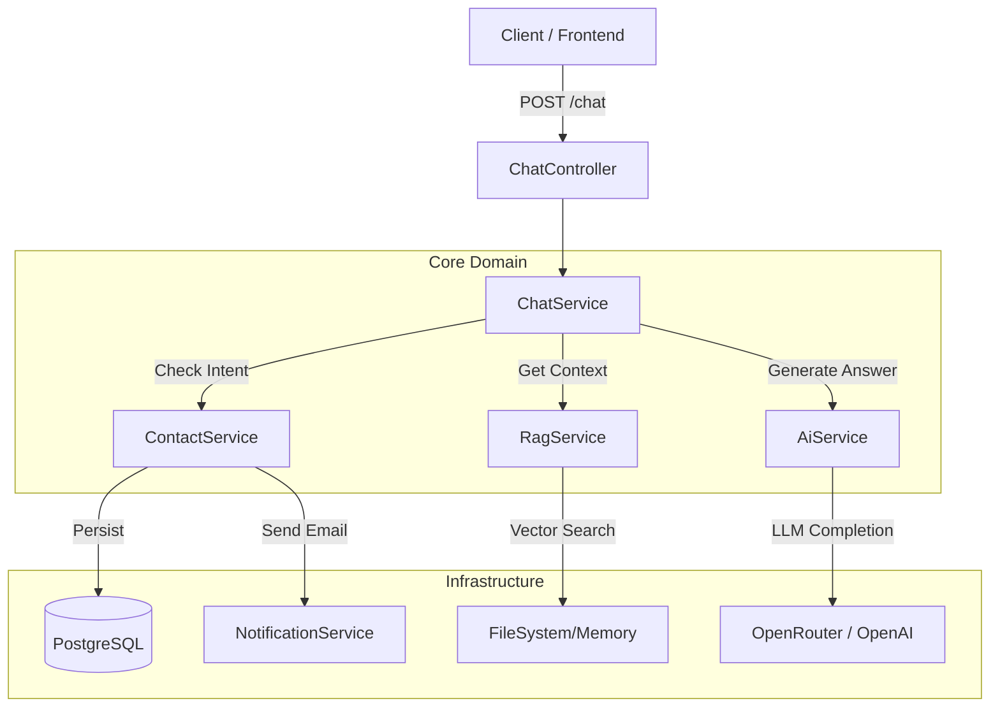

# 🤖 AI-Powered CV Assistant (Backend)

> A modular NestJS backend that enables recruiters to have a natural conversation with my professional "Digital Twin". Powered by RAG (Retrieval-Augmented Generation), OpenAI, and a Clean Architecture approach.


## 📋 Overview

This project is not just a chatbot; it's a demonstration of **Senior Backend Engineering practices**. It serves as an interactive portfolio where an AI answers questions about my experience, skills, and projects based on a dynamic context (CV), while also managing lead generation through a conversational flow.

### Key Features
* **Modular Architecture:** Separation of concerns using Domain-Driven Design principles (Chat, Contact, RAG, AI, Notification).
* **Dynamic RAG System:** The knowledge base (CV embeddings) is not hardcoded. It can be updated via API endpoints (`/knowledge/upload`) without redeploying.
* **State Machine for Leads:** A dedicated `ContactModule` handles a multi-step flow to capture recruiter details (Name -> Phone -> Email -> Meeting) efficiently.
* **Solid Engineering:**
    * Strict Environment Validation (`Joi`).
    * DTO Validation & Transformation (`class-validator`).
    * Dependency Injection & Inversion of Control.
    * Comprehensive Unit Testing (Service & Controller layers).
* **Security:** CORS configuration, controlled Swagger exposure (dev-only), and input sanitization.

---

## 🏗️ Architecture

The `ChatModule` acts as the orchestrator, delegating tasks to specialized domains:



---

## 🚀 Getting Started

### Prerequisites

* Node.js
* PostgreSQL Database
* An API Key from OpenRouter or OpenAI

### 1. Installation

```bash
# Clone the repository
git clone [https://github.com/enlabedev/ai-cv-backend.git](https://github.com/enlabedev/ai-cv-backend.git)

# Enter the directory
cd ai-cv-backend

# Install dependencies
npm install

```

### 2. Environment Configuration

Create a `.env` file in the root directory. You can copy the structure below:

```env
# Server
PORT=3000
NODE_ENV=development

# Database (PostgreSQL)
POSTGRES_HOST=localhost
POSTGRES_PORT=5432
POSTGRES_USER=your_user
POSTGRES_PASSWORD=your_password
POSTGRES_DB=ai_cv_db

# AI Provider (OpenRouter/OpenAI)
OPENAI_API_KEY=sk-or-v1-your-api-key...

# Email Service (SMTP)
EMAIL_HOST=smtp.gmail.com
EMAIL_PORT=587
EMAIL_USER=your_email@gmail.com
EMAIL_PASS=your_app_password
EMAIL_FROM="Enrique Lazo <noreply@yourdomain.com>"

# RAG Storage
EMBEDDINGS_FILE_PATH=./data/cv-embeddings.json

```

### 3. Running the App

```bash
# Development mode
npm run start:dev

# Production mode
npm run build
npm run start:prod

```

---

## 📚 API Documentation

When running in **development mode**, the Swagger documentation is automatically generated and accessible at:

👉 **http://localhost:3000/api/docs**

### Main Endpoints

| Method | Endpoint | Description |
| --- | --- | --- |
| `POST` | `/chat` | Send a message to the AI. Handles both Q&A and Contact flows. |
| `POST` | `/knowledge/upload` | Upload a new JSON file with CV embeddings to update the brain. |
| `DELETE` | `/knowledge` | Clear the current knowledge base from memory and disk. |

---

## 🧪 Testing

This project maintains high test coverage for critical business logic.

```bash
# Run unit tests
npm run test

# Run test coverage report
npm run test:cov

```

---

## 🛠️ Tech Stack

* **Framework:** NestJS (Node.js)
* **Language:** TypeScript
* **Database:** PostgreSQL with TypeORM (Auto-load entities enabled)
* **AI/ML:** OpenAI SDK (via OpenRouter), Vector Cosine Similarity (Custom implementation for performance)
* **Email:** Nodemailer with Handlebars-like templating
* **Docs:** Swagger (OpenAPI 3.0)

---

## 👤 Author

**Enrique Lazo Bello** *Senior Full Stack Developer*

